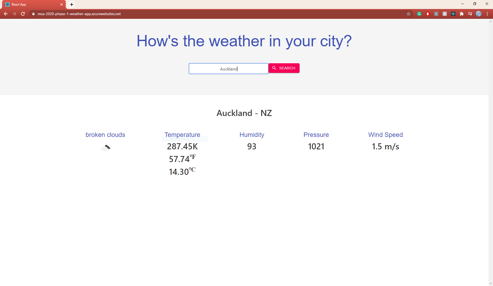

# MSA_2020_WeatherApp
This Web application was made for the submission of Phase 1 in the MSA program in 2020.

## Description
This Web application inform the user of the weather forecast in different cities. This is done by promting the user to input the city name into the search bar and press 'enter' or click the 'search' button. The weather data such as temperature, humidity, pressure, wind speed and a short description corresponding to the result of the search will appear. 

**The app was made using the React library in the Typescript language as well as Redux.** 
The reason why i used Redux instead of React Context API is because Redux is a great tool to help me manage my states.
Redux maintains the state of an entire application in a single immutable state tree which can't be changed directly. Although the trade-offs of using Redux for this simple Web application is not greatly benefitial, i chose to implement it as a learning experience as it is much more useful in larger scale applications. 

## Build & Release Pipelines description
In the azure-pipelines.yml, my build pipeline is triggered each time a commit is made to my master or develop branches. The artifact is produced when the pipeline is triggered, it automatically compiles and builds my project. Since there is no need to rebuild the pipeline when the readme file is modified, I have excluded the pipeline from being triggered when commits are made to the README.md file. The operating system that will be used to build the web app is also specified in the on on the ubuntu and windows virtual machine images. Variables rootDir and buildDir are declared. In the steps section, the settings of the pipeline is configured as well as installing important packages. The release pipeline is only triggered when a new build artifact is generated by the master branch and this allows me to create new features and add additional functionality on the develop branch and I can test and choose which updates I want to push and merge to the master branch and therefore to my live web app.

**Third party API used can be found at [OpenWeather](https://openweathermap.org/current)**

**UI library used:** **[Material-UI](https://material-ui.com/)**

## Submission Details

**Website URL: https://msa-2020-phase-1-weather-app.azurewebsites.net/**

**Microsoft Learn Personal info, username and URL: https://docs.microsoft.com/en-us/users/MichaelPham-6558**

**The screen shots of the Microsoft Learn modules and be found in the '\ML screenshots\' folder** 

